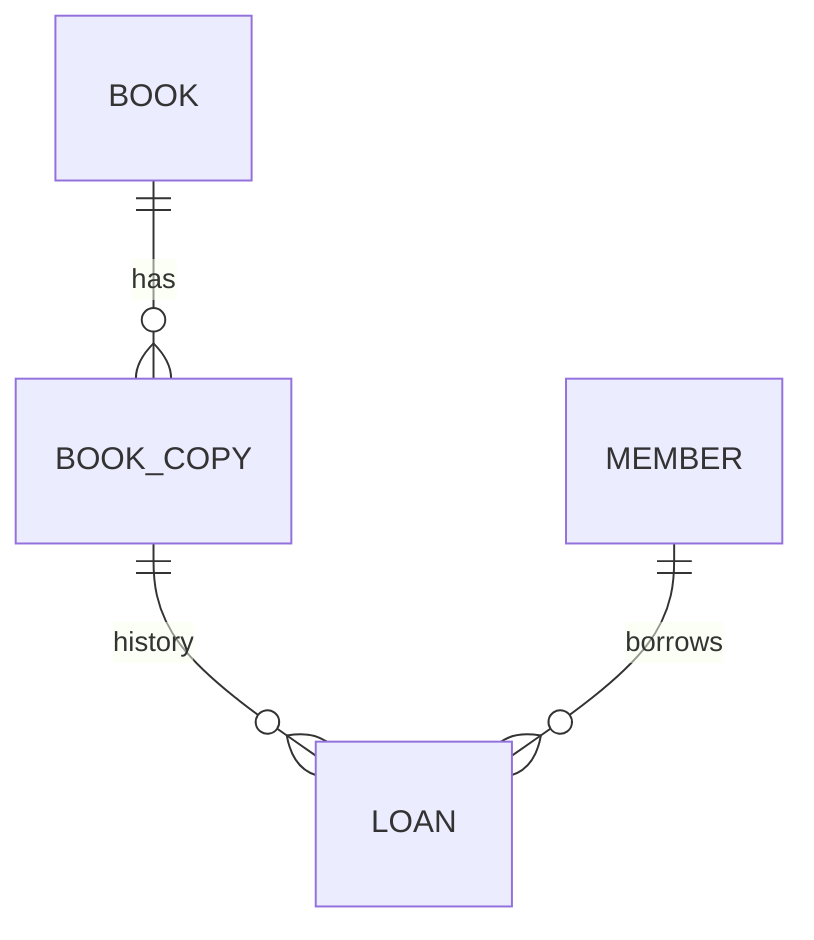

# Library Desk — Spring Boot API

A library circulation backend built with Java 17, Spring Boot, Spring Data JPA and a relational database. The project models **titles, physical copies, readers and loans** rather than treating every book as a single CRUD record. A separate [web interface](https://github.com/jiwei-wu/library-web-app) consumes the API.

## What it does

- Register a title with one or more individually identified copies; add copies later.
- Search titles by a case-insensitive substring, with pagination.
- Register readers using a unique email address.
- Borrow the first available physical copy for 14 days; a reader may hold at most three active loans.
- Return a loan once; returned copies become available again while the loan history remains.
- Return clear HTTP errors for invalid input, missing resources and business conflicts.

Checkout locks the reader row while checking the loan limit and locks the book row while choosing a copy. Return also locks the book row. This serializes checkout and return for a given title and prevents two checkout requests from selecting its last available copy at once. The two lock types are acquired consistently for checkout. Integration tests exercise availability, the loan limit, duplicate ISBNs, returns, search and copy inventory.

## Run locally

Requirements: **Java 17**. Maven is supplied via the wrapper. The default profile uses an in-memory H2 database; no database setup is needed.

```bash
./mvnw test
./mvnw spring-boot:run
```

The API listens on `http://localhost:8080/api`. In-memory data is reset when the application stops. The H2 console is available at `http://localhost:8080/h2-console` with JDBC URL `jdbc:h2:mem:library` and username `sa` for local development.

For an optional **persistent local MySQL** database:

```bash
docker compose up -d mysql
DB_PASSWORD=local_library_password ./mvnw spring-boot:run -Dspring-boot.run.profiles=mysql
```

The MySQL profile reads `DB_URL`, `DB_USERNAME` and `DB_PASSWORD` from the environment. Its schema update setting is for this local demo, not a production migration strategy. The compose file contains local demonstration credentials; change them before using the database beyond a personal development machine.

## API

| Method | Endpoint | Purpose |
| --- | --- | --- |
| `POST` | `/api/books` | Create a title with 1–20 copies |
| `GET` | `/api/books?title=clean&page=0&size=10` | Paginated search (title optional) |
| `GET` | `/api/books/{id}` | Title and current copy availability |
| `POST` | `/api/books/{id}/copies` | Add 1–20 physical copies |
| `POST` | `/api/members` | Register a reader |
| `POST` | `/api/loans` | Borrow a copy by reader and title IDs |
| `POST` | `/api/loans/{id}/return` | Return one active loan |
| `GET` | `/api/members/{id}/loans` | Loan history for one reader |

Example end-to-end flow (IDs below assume an empty database):

```bash
curl -X POST http://localhost:8080/api/books \
  -H 'Content-Type: application/json' \
  -d '{"title":"Clean Code","author":"Robert Martin","isbn":"9780132350884","copies":2}'

curl -X POST http://localhost:8080/api/members \
  -H 'Content-Type: application/json' \
  -d '{"name":"Example Reader","email":"reader@example.com"}'

curl -X POST http://localhost:8080/api/loans \
  -H 'Content-Type: application/json' \
  -d '{"memberId":1,"bookId":1}'

curl http://localhost:8080/api/books/1
curl http://localhost:8080/api/members/1/loans
curl -X POST http://localhost:8080/api/loans/1/return
```

Responses use JSON. Successful creates return `201`, validation errors `400`, missing IDs `404`, and domain conflicts (no copy, duplicate ISBN/email, repeat return, loan limit) `409` with a `message` field. ISBN is treated as a unique catalogue identifier; it is not currently checksum validated.

## Data model and code structure



- `api`: request and response records, controllers, HTTP error handling.
- `service`: transactional catalogue and circulation rules.
- `model`: JPA entities for books, copies, members and loans.
- `repository`: persistence queries, including row-lock operations.
- `src/test`: integration tests against H2.
- `.github/workflows/verify.yml`: runs the integration suite on GitHub Actions.

## Scope

This is a portfolio application and a local staff-facing demo. It does not currently include staff authentication, authorization, overdue fees or automated database migrations. These would be required before using it as a deployed library service. The frontend is a separate, dependency-free repository.
